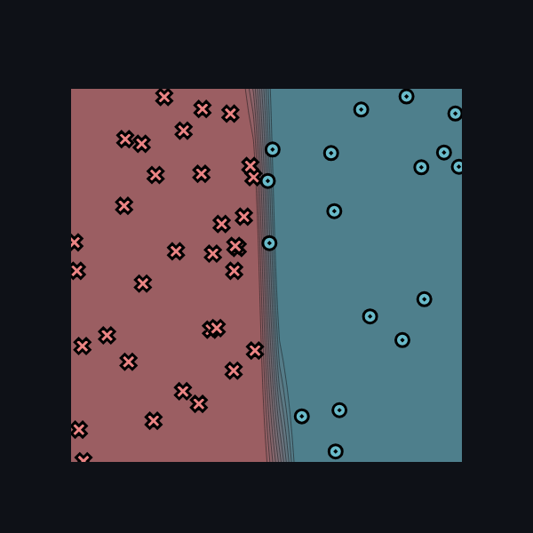
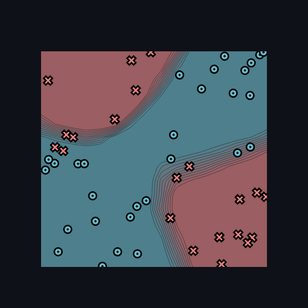
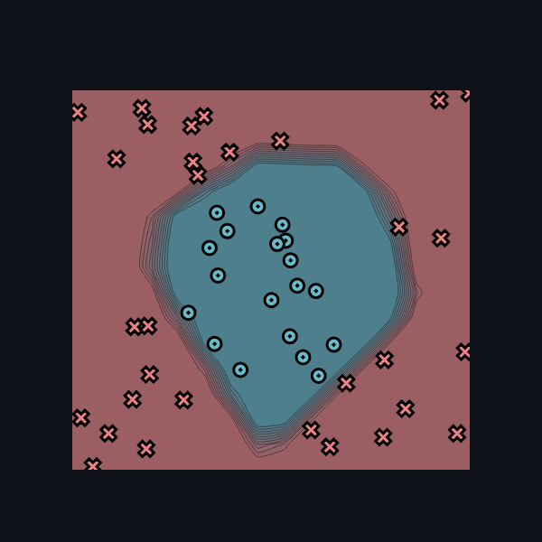
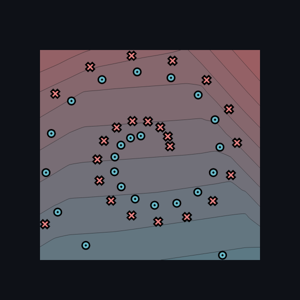

# Task 2.5

## Settings

* **Size of hidden layers**: 10
* **Learning rate**: 0.5
* **Number of epochs**: 500

## Training results

### Simple

**logs**

```
Epoch: 0/500, loss: 0, correct: 0
Epoch: 10/500, loss: 22.907094570588054, correct: 33
Epoch: 20/500, loss: 12.95214515836971, correct: 47
Epoch: 30/500, loss: 44.4333466938654, correct: 26
Epoch: 40/500, loss: 7.41630938061443, correct: 47
Epoch: 50/500, loss: 11.811680404404559, correct: 45
Epoch: 60/500, loss: 5.806623966826002, correct: 47
Epoch: 70/500, loss: 15.930356555523646, correct: 44
Epoch: 80/500, loss: 6.745649775889991, correct: 47
Epoch: 90/500, loss: 7.736997394678864, correct: 47
Epoch: 100/500, loss: 7.6784230254594075, correct: 47
Epoch: 110/500, loss: 7.38308484410364, correct: 47
Epoch: 120/500, loss: 7.147324439813934, correct: 47
Epoch: 130/500, loss: 6.789903746028538, correct: 47
Epoch: 140/500, loss: 6.718044312200065, correct: 47
Epoch: 150/500, loss: 6.479269256526767, correct: 47
Epoch: 160/500, loss: 6.385229862185673, correct: 47
Epoch: 170/500, loss: 6.219632628041595, correct: 47
Epoch: 180/500, loss: 6.04764542898848, correct: 47
Epoch: 190/500, loss: 5.870241058514249, correct: 47
Epoch: 200/500, loss: 5.709787157080045, correct: 47
Epoch: 210/500, loss: 5.574784390916256, correct: 47
Epoch: 220/500, loss: 5.507113879325806, correct: 47
Epoch: 230/500, loss: 5.358831495192921, correct: 47
Epoch: 240/500, loss: 5.217078792257562, correct: 47
Epoch: 250/500, loss: 5.077661615784737, correct: 47
Epoch: 260/500, loss: 4.965264695352843, correct: 47
Epoch: 270/500, loss: 4.849074344195999, correct: 47
Epoch: 280/500, loss: 4.740035233897519, correct: 47
Epoch: 290/500, loss: 4.624724350782988, correct: 47
Epoch: 300/500, loss: 4.528176398865616, correct: 47
Epoch: 310/500, loss: 4.441651551932875, correct: 47
Epoch: 320/500, loss: 4.357938310526892, correct: 47
Epoch: 330/500, loss: 4.259822263206171, correct: 47
Epoch: 340/500, loss: 4.176299511618997, correct: 47
Epoch: 350/500, loss: 4.089728653656746, correct: 47
Epoch: 360/500, loss: 4.011830905422352, correct: 47
Epoch: 370/500, loss: 3.9322095528691516, correct: 47
Epoch: 380/500, loss: 3.963757550020747, correct: 47
Epoch: 390/500, loss: 3.8197960299911835, correct: 47
Epoch: 400/500, loss: 3.707105514748015, correct: 47
Epoch: 410/500, loss: 3.7613592523940165, correct: 47
Epoch: 420/500, loss: 3.6192708731088215, correct: 47
Epoch: 430/500, loss: 3.619192832700295, correct: 47
Epoch: 440/500, loss: 3.478288219181843, correct: 48
Epoch: 450/500, loss: 3.4653280786347667, correct: 48
Epoch: 460/500, loss: 3.4154362432661536, correct: 48
Epoch: 470/500, loss: 3.3762481588310456, correct: 48
Epoch: 480/500, loss: 3.4194183336451, correct: 48
Epoch: 490/500, loss: 3.2622658488221936, correct: 48
Epoch: 500/500, loss: 3.158870248799378, correct: 48
```

**Final image**



### Xor

**logs**

```
Epoch: 0/500, loss: 0, correct: 0
Epoch: 10/500, loss: 26.779852274505327, correct: 37
Epoch: 20/500, loss: 23.7534073775861, correct: 38
Epoch: 30/500, loss: 22.92473662172298, correct: 38
Epoch: 40/500, loss: 20.24312730667909, correct: 40
Epoch: 50/500, loss: 18.940532014471604, correct: 39
Epoch: 60/500, loss: 17.865473362292935, correct: 41
Epoch: 70/500, loss: 19.919151225526065, correct: 39
Epoch: 80/500, loss: 18.956452192184248, correct: 39
Epoch: 90/500, loss: 20.03288762591163, correct: 39
Epoch: 100/500, loss: 18.309748846403497, correct: 39
Epoch: 110/500, loss: 18.18372119621888, correct: 39
Epoch: 120/500, loss: 18.236983171680592, correct: 39
Epoch: 130/500, loss: 17.355118387671578, correct: 40
Epoch: 140/500, loss: 16.396745342571293, correct: 40
Epoch: 150/500, loss: 16.278932127164353, correct: 40
Epoch: 160/500, loss: 17.523540004452798, correct: 39
Epoch: 170/500, loss: 16.041034914667783, correct: 40
Epoch: 180/500, loss: 14.564154612965238, correct: 40
Epoch: 190/500, loss: 15.11130827699401, correct: 40
Epoch: 200/500, loss: 15.540964297143425, correct: 40
Epoch: 210/500, loss: 15.1504866787376, correct: 40
Epoch: 220/500, loss: 14.065194107036655, correct: 41
Epoch: 230/500, loss: 13.446805587524079, correct: 42
Epoch: 240/500, loss: 13.23655085192855, correct: 42
Epoch: 250/500, loss: 13.835463530946807, correct: 41
Epoch: 260/500, loss: 14.291229647394186, correct: 41
Epoch: 270/500, loss: 36.66004244625828, correct: 34
Epoch: 280/500, loss: 10.317064665711184, correct: 45
Epoch: 290/500, loss: 9.819125259234825, correct: 45
Epoch: 300/500, loss: 10.483933427407276, correct: 43
Epoch: 310/500, loss: 14.592822031156226, correct: 40
Epoch: 320/500, loss: 10.11779907711305, correct: 43
Epoch: 330/500, loss: 8.992314202478699, correct: 45
Epoch: 340/500, loss: 9.333404940727272, correct: 43
Epoch: 350/500, loss: 11.719912732325266, correct: 42
Epoch: 360/500, loss: 10.133977186866838, correct: 43
Epoch: 370/500, loss: 7.2444848384083675, correct: 46
Epoch: 380/500, loss: 7.019942020567493, correct: 47
Epoch: 390/500, loss: 40.456466260028094, correct: 35
Epoch: 400/500, loss: 6.637498179277257, correct: 48
Epoch: 410/500, loss: 6.2039292930578736, correct: 48
Epoch: 420/500, loss: 5.797327820874345, correct: 48
Epoch: 430/500, loss: 5.439437677579315, correct: 48
Epoch: 440/500, loss: 5.060065159959859, correct: 48
Epoch: 450/500, loss: 4.773345310373119, correct: 49
Epoch: 460/500, loss: 4.532945652366594, correct: 49
Epoch: 470/500, loss: 4.380703577769091, correct: 49
Epoch: 480/500, loss: 4.7059848051735464, correct: 48
Epoch: 490/500, loss: 7.939324440658309, correct: 47
Epoch: 500/500, loss: 9.137077378161985, correct: 47
```

**images**



### Circle

**logs**

```
Epoch: 0/500, loss: 0, correct: 0
Epoch: 10/500, loss: 31.296645779089204, correct: 31
Epoch: 20/500, loss: 30.320421161180395, correct: 31
Epoch: 30/500, loss: 29.186567356669116, correct: 31
Epoch: 40/500, loss: 27.76370555333394, correct: 33
Epoch: 50/500, loss: 25.85104628324932, correct: 40
Epoch: 60/500, loss: 23.397571905096108, correct: 40
Epoch: 70/500, loss: 20.92434888194454, correct: 42
Epoch: 80/500, loss: 19.648136618880287, correct: 42
Epoch: 90/500, loss: 16.20827476813272, correct: 45
Epoch: 100/500, loss: 16.749544538962514, correct: 43
Epoch: 110/500, loss: 12.133930155675058, correct: 46
Epoch: 120/500, loss: 13.881274654978927, correct: 43
Epoch: 130/500, loss: 15.478096066136143, correct: 42
Epoch: 140/500, loss: 10.858147101086, correct: 45
Epoch: 150/500, loss: 7.531504337600144, correct: 49
Epoch: 160/500, loss: 5.840903950368489, correct: 50
Epoch: 170/500, loss: 5.055277716242216, correct: 50
Epoch: 180/500, loss: 7.034340310944478, correct: 46
Epoch: 190/500, loss: 6.479248507927478, correct: 49
Epoch: 200/500, loss: 4.291253890414554, correct: 50
Epoch: 210/500, loss: 3.8284640066858007, correct: 50
Epoch: 220/500, loss: 3.6003576273339886, correct: 50
Epoch: 230/500, loss: 3.832009230194255, correct: 49
Epoch: 240/500, loss: 5.1902158660867075, correct: 46
Epoch: 250/500, loss: 15.714550417599316, correct: 43
Epoch: 260/500, loss: 2.4153301514820433, correct: 50
Epoch: 270/500, loss: 2.1203466329005716, correct: 50
Epoch: 280/500, loss: 1.9351353503852051, correct: 50
Epoch: 290/500, loss: 1.7809328859499651, correct: 50
Epoch: 300/500, loss: 1.6499417387516195, correct: 50
Epoch: 310/500, loss: 1.5360918521816185, correct: 50
Epoch: 320/500, loss: 1.4309493854738484, correct: 50
Epoch: 330/500, loss: 1.3348981491221719, correct: 50
Epoch: 340/500, loss: 1.251344341402851, correct: 50
Epoch: 350/500, loss: 1.177407821863113, correct: 50
Epoch: 360/500, loss: 1.1113210184761744, correct: 50
Epoch: 370/500, loss: 1.051849087050651, correct: 50
Epoch: 380/500, loss: 0.9979242598138318, correct: 50
Epoch: 390/500, loss: 0.9487630658702155, correct: 50
Epoch: 400/500, loss: 0.9037162770141187, correct: 50
Epoch: 410/500, loss: 0.8622714160862593, correct: 50
Epoch: 420/500, loss: 0.8240138649037221, correct: 50
Epoch: 430/500, loss: 0.7885874029791707, correct: 50
Epoch: 440/500, loss: 0.7556783917142536, correct: 50
Epoch: 450/500, loss: 0.72502968332826, correct: 50
Epoch: 460/500, loss: 0.6964302850475056, correct: 50
Epoch: 470/500, loss: 0.6696757562734075, correct: 50
Epoch: 480/500, loss: 0.6445980560005553, correct: 50
Epoch: 490/500, loss: 0.6210522632274958, correct: 50
Epoch: 500/500, loss: 0.5989184816449756, correct: 50
```

**images**



### Spiral

**logs**

```
Epoch: 0/500, loss: 0, correct: 0
Epoch: 10/500, loss: 34.08783069047314, correct: 28
Epoch: 20/500, loss: 34.01456395478665, correct: 28
Epoch: 30/500, loss: 33.965088136813606, correct: 29
Epoch: 40/500, loss: 33.92383220301543, correct: 29
Epoch: 50/500, loss: 33.891977173561685, correct: 29
Epoch: 60/500, loss: 33.86219903212022, correct: 29
Epoch: 70/500, loss: 33.83848796271666, correct: 29
Epoch: 80/500, loss: 33.818417567836825, correct: 29
Epoch: 90/500, loss: 33.79644546762271, correct: 29
Epoch: 100/500, loss: 33.77928794616234, correct: 29
Epoch: 110/500, loss: 33.76186467858622, correct: 29
Epoch: 120/500, loss: 33.74787373649421, correct: 29
Epoch: 130/500, loss: 33.73103198425006, correct: 29
Epoch: 140/500, loss: 33.71298985857337, correct: 28
Epoch: 150/500, loss: 33.69594269172644, correct: 28
Epoch: 160/500, loss: 33.67962448085667, correct: 28
Epoch: 170/500, loss: 33.66154554757092, correct: 28
Epoch: 180/500, loss: 33.643602350036005, correct: 28
Epoch: 190/500, loss: 33.625808113520534, correct: 28
Epoch: 200/500, loss: 33.610200354253124, correct: 28
Epoch: 210/500, loss: 33.59842853627706, correct: 28
Epoch: 220/500, loss: 33.58362818796211, correct: 28
Epoch: 230/500, loss: 33.57025444251087, correct: 28
Epoch: 240/500, loss: 33.555763887306256, correct: 28
Epoch: 250/500, loss: 33.5446949608195, correct: 28
Epoch: 260/500, loss: 33.538533524706196, correct: 28
Epoch: 270/500, loss: 33.5288652351439, correct: 28
Epoch: 280/500, loss: 33.52799802734309, correct: 28
Epoch: 290/500, loss: 33.503299599638304, correct: 28
Epoch: 300/500, loss: 33.49494005902869, correct: 28
Epoch: 310/500, loss: 33.4900946639879, correct: 28
Epoch: 320/500, loss: 33.5126715337913, correct: 29
Epoch: 330/500, loss: 33.47165759861067, correct: 28
Epoch: 340/500, loss: 33.488730919250344, correct: 30
Epoch: 350/500, loss: 33.48352224823367, correct: 31
Epoch: 360/500, loss: 33.46435789181746, correct: 29
Epoch: 370/500, loss: 33.48009115206757, correct: 30
Epoch: 380/500, loss: 33.71132772476908, correct: 26
Epoch: 390/500, loss: 33.437432422929724, correct: 30
Epoch: 400/500, loss: 33.40394361100099, correct: 28
Epoch: 410/500, loss: 33.400263667885966, correct: 30
Epoch: 420/500, loss: 33.49752812957944, correct: 28
Epoch: 430/500, loss: 34.17314998204377, correct: 27
Epoch: 440/500, loss: 33.48250300823331, correct: 29
Epoch: 450/500, loss: 33.37237055218235, correct: 29
Epoch: 460/500, loss: 33.36215083084887, correct: 30
Epoch: 470/500, loss: 33.39014115701325, correct: 29
Epoch: 480/500, loss: 33.50081048549186, correct: 26
Epoch: 490/500, loss: 34.00796574047449, correct: 28
Epoch: 500/500, loss: 33.40986137121468, correct: 29
```

**image**

